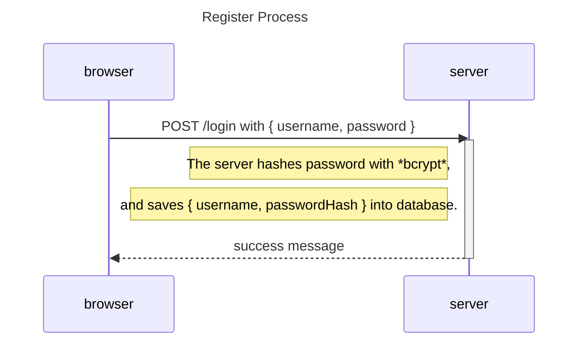
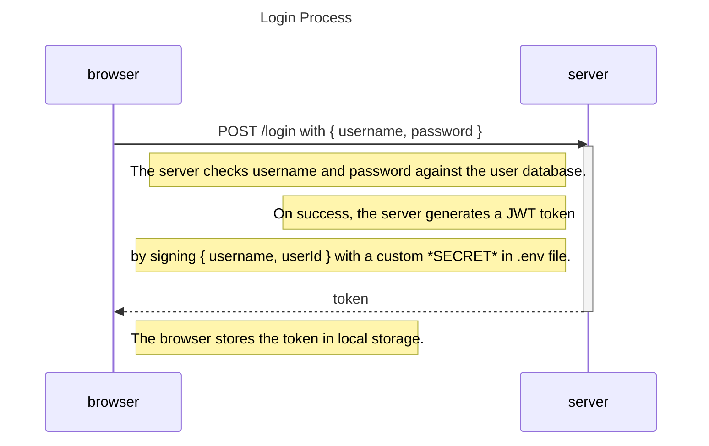
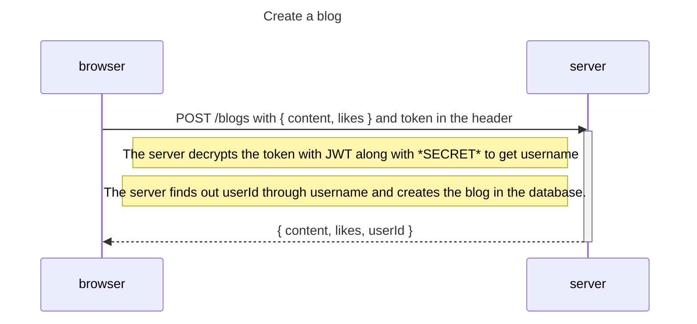
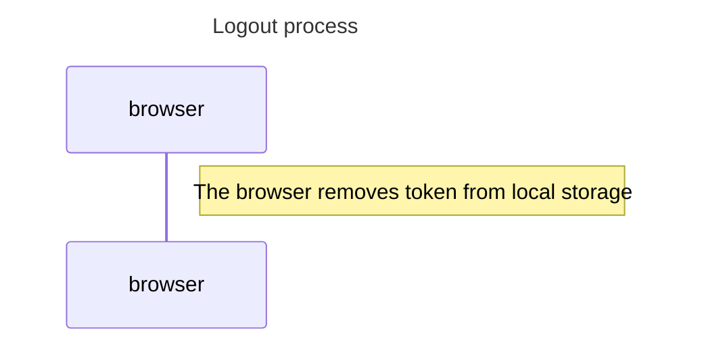

# dive-deep-web-dev-exercises

```mermaid
sequenceDiagram
title Register Process
    browser->>server: POST /login with { username, password }
    activate server
    Note left of server: The server hashes password with *bcrypt*,
    Note left of server: and saves { username, passwordHash } into database.
    server-->>browser: success message
    deactivate server 
```

```mermaid
sequenceDiagram
title Login Process
    browser->>server: POST /login with { username, password }
    activate server
    Note left of server: The server checks username and password against the user database.
    Note left of server: On success, the server generates a JWT token
    Note left of server: by signing { username, userId } with a custom *SECRET* in .env file.
    server-->>browser: token
    deactivate server

    Note right of browser: The browser stores the token in local storage.
```

```mermaid
sequenceDiagram
title Create a blog
    browser->>server: POST /blogs with { content, likes } and token in the header
    activate server
    Note left of server: The server decrypts the token with JWT along with *SECRET* to get username
    Note left of server: The server finds out userId through username and creates the blog in the database.
    server-->>browser: { content, likes, userId }
    deactivate server
```

```mermaid
sequenceDiagram
title Logout process
    Note right of browser: The browser removes token from local storage
```
